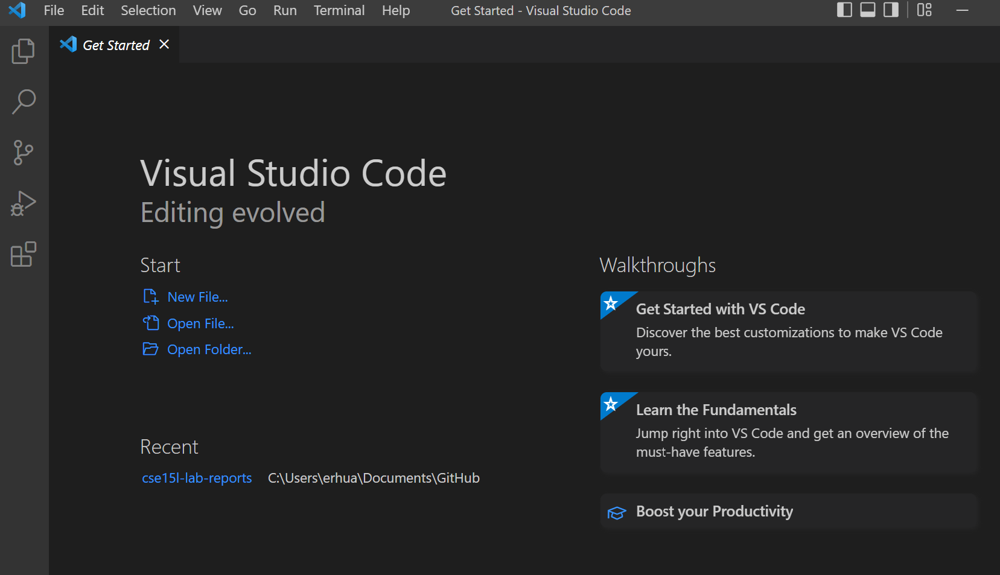
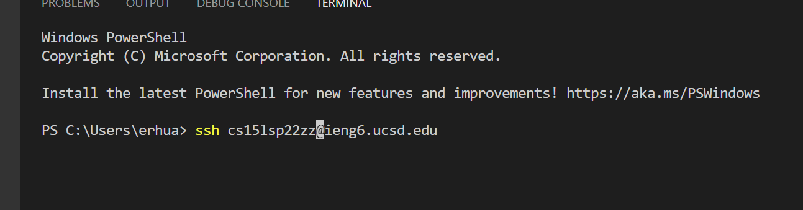
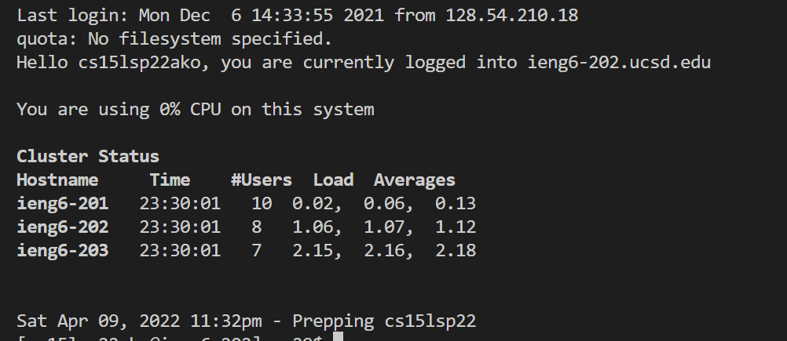
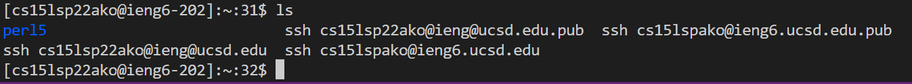
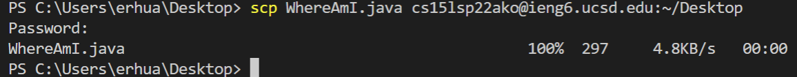
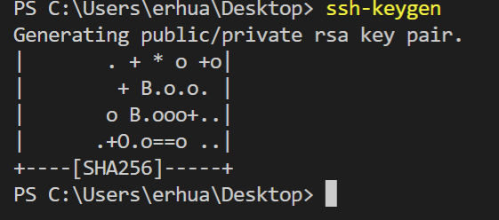
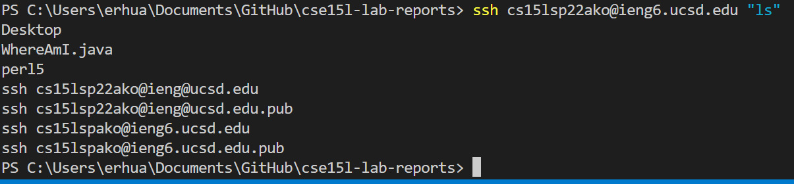

# Lab Report 1

## **Installing VScode**

Visit the [Visual Studio Code](https://code.visualstudio.com/) website and download it. When installed the window should look something like this: 



## **Remotely Connecting**

To remotely connect, first install [OpenSSH](https://docs.microsoft.com/en-us/windows-server/administration/openssh/openssh_install_firstuse) if your on windows, then find your account [here](https://sdacs.ucsd.edu/~icc/index.php). Next open a terminal in VScode(by clicking terminal -> New Terminal) and type in the command : "ssh cs15lsp22zz@ieng6.ucsd.edu" and replace the "zz" with your account specific letters. 



Login using your account-specific password then you will see that you have connected to a computer in the CSE basement.



## Trying Some Commands

Now in the terminal, try some commands such as these and see what they do:

```
cd~

cd

ls -lat

ls -a

cp /home/linux/ieng6/cs15lsp22/public/hello.txt ~/

cat /home/linux/ieng6/cs15lsp22/public/hello.txt

```

An example of using cd:


The command ls lists all the files in the current directory except hidden ones.

## **Moving files with scp**
To copy or move a file(a java file in this example) from your computer to the server, we can use the command "scp" which will always run on your computer(the client side). Type "scp" then "filename.java " followed by your username and "~/".



## **Setting an SSH Key**
 The command "ssh-keygen" allows us to access code without logging in each time, instead asking for a passphrase. This passphrase can(and should) be set to empty for easier use. When you make a keygen it should look like this. Next time you use scp or ssh it should not prompt you for your password. 



## **Optimizing Remote Running**
You can use ssh to directly run commands on the server. You can also use semicolins to run multiple commands at once. You can also use the up arrow to run previous commands.




