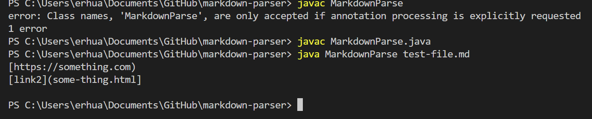
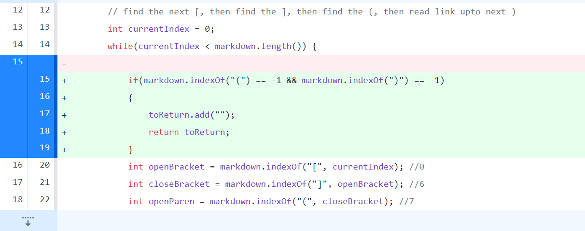
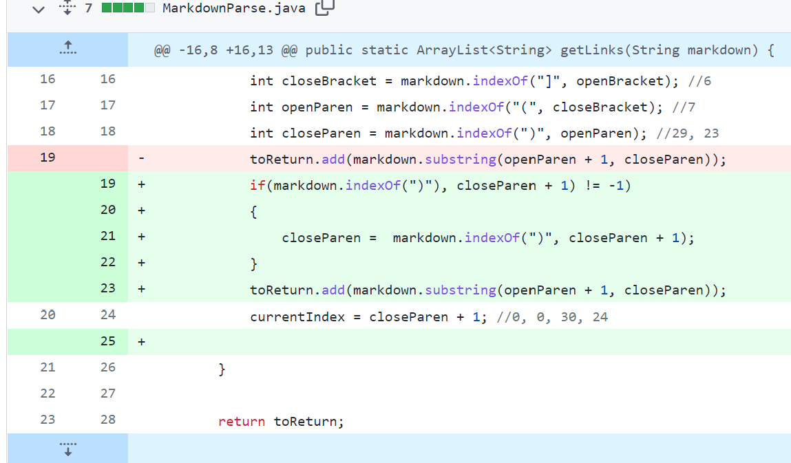

# Lab Report 2

## Bug 1: Incorrect link

 
This bug occured because we added a statement to catch cases where the link included parenthesis but it didn't work for normal links so we removed it.

Test File: [test-file.md](https://github.com/erhuang623/markdown-parser/blob/main/test-file.md?plain=1)

We removed that if statment, which checks for a close parentheses in the link.The bug is that it only works in the case that there was a parenthesis in the link, but when given two normal links it will produce the wrong output. The symptom is that it gives the first link, then gives the markdown command for a link.

## Bug 2: Out of bounds exception 

Test file: [test-file4.md](https://github.com/erhuang623/markdown-parser/blob/main/test-file4.md?plain=1)

We added that if statement to check if there was a link but no brackets. If that were the case we return an empty string rather than running in to an out of bounds exception.

## Bug 3: Not giving full link if there was parenthesis in link.

Test file: [test-file2.md](https://github.com/erhuang623/markdown-parser/blob/main/test-file2.md?plain=1)

This is what the links were when the first link was expected to contain a parenthesis.

This is what we wanted when calling the link.

The bug is that it only considers everything in between the first open and close parenthesis, so when having a link with a parenthesis it will cut off the rest of the link after the first closeParentheses. 

