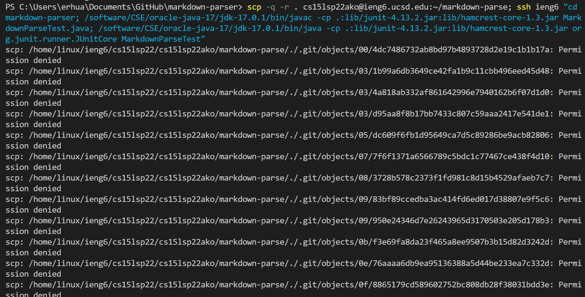

# Lab Report 3

## Streamlining ssh Configuration
First you make a new file called config in our .ssh folder on our local machine. Then type that command with your unique username.


Note that the third line is specifically for windows. 

Next use the ssh command to log into your account with the specific alias you have chosen.


This is an example of the scp command copying a file into the ieng6 account. 


## Setup Github Access from ieng6
This is the public key on gitbuh stored in my account settings


This is my private key which is stored in known_hosts of my .ssh folder.


This image shows git commands running on the remote server.


This is the commit [History]()

## Copy whole directories with scp -r
We can use the command
```
scp -r
```
to copy a whole directory to the remote machine


We can now log into the remote server and compile the repository.


We can also run multiple commands at a time to copy and run the tests at the same time. 


