# Lab Report 4

[markdown-parse Link](https://github.com/erhuang623/markdown-parser)

[Reviewed markdown-parse Link](https://github.com/alixintong/markdown-parser)

## Code snippet 1:

I believe code snippet 1 should produce these links:

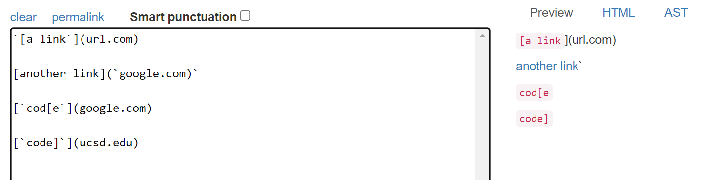

Test case:
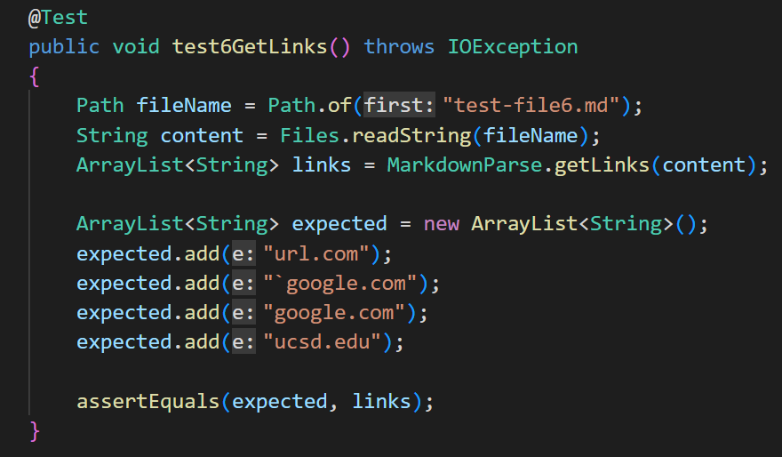

My failed test case:
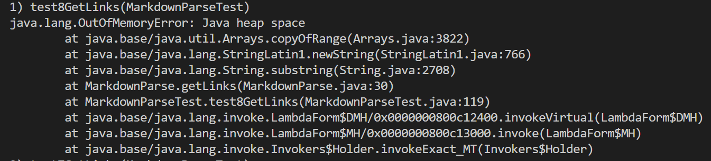

Reviewed case:
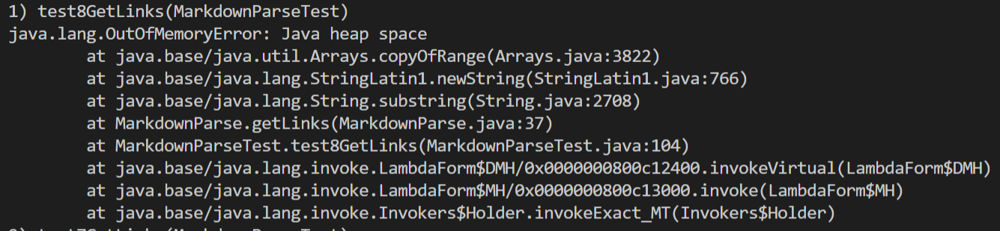

Code Changes: First I have an out of memory exception which can be fixed by changing my loop. I believe that it isn't possible to make a small change to pass this test due to my infinite loop as well as edge cases like backticks. I feel like it would be a big change to consider backticks, as well as multiple brackets in a link.

## Code snippet 2:
I think snippet 2 should produce this:
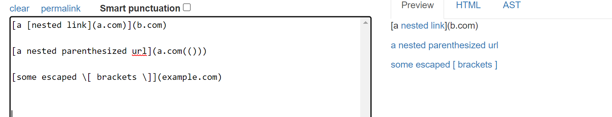

Test case:
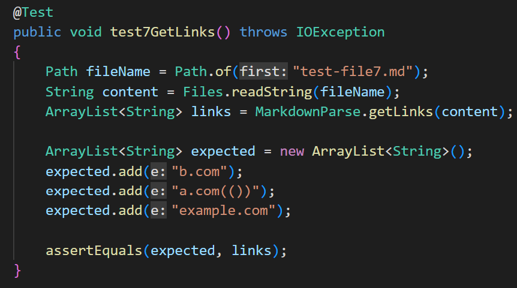

My failed test case:
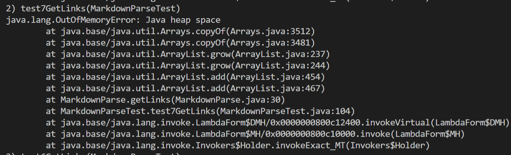

Reviewed case:
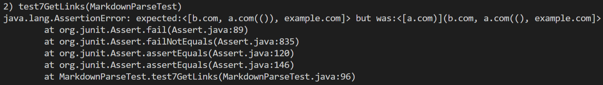

Code Changes: Again, I have an out of memory error but besides that, I believe it may be possible to fix it with a small change because my code considers cases for multiple brackets. I believe nested brackets will prove a little more difficult but possible.

## Code snippet 3:
snippet 3 should produce these links:
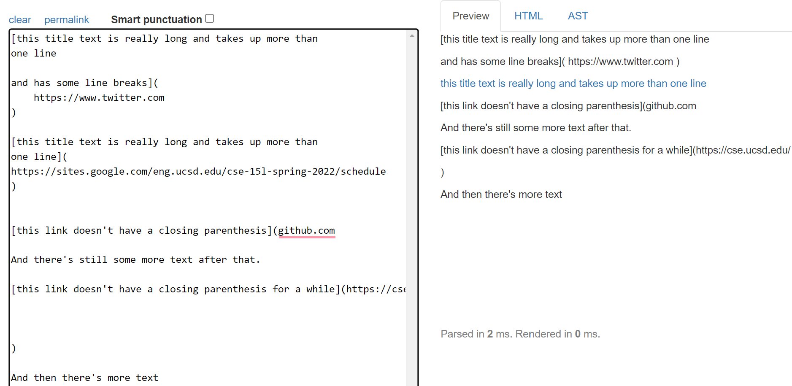

Test case:
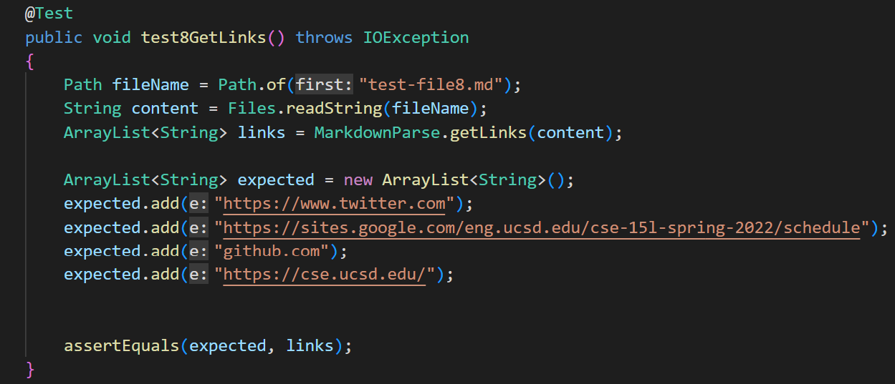

My failed test case:
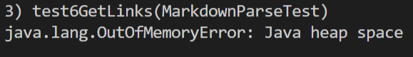

Reviewed case:
It passed the test case.

Code Changes: With my other test cases, I believe there is an infinte loop that can be fixed in 10 lines or less. 